# Super AI Agency Framework

> 🚀 A persona-driven AI development framework that merges **13 expert AI agents** with **GitHub Spec-Kit v0.4.4** and **spec-kit-learn v1.1.0** to deliver a structured, gated, spec-driven development workflow from strategy to production with a full post-ship learning loop.

[](CHANGELOG.md)
[](https://github.com/github/spec-kit)
[](https://github.com/imviancagrace/spec-kit-learn)
[](Artifacts/00_Governance/CONSTITUTION.md)
[](LICENSE)
[](.agent/skills/)
[](SIMULATION_GUIDE.md)

---

## Table of Contents

- [What is This?](#-what-is-this)
- [🆕 What's New in v2.0](#-whats-new-in-v20)
- [The 9-Phase Workflow](#-the-9-phase-workflow)
- [🗺️ Workflow Diagram](#-workflow-diagram)
- [Get Started](#-get-started)
- [Simulation Guide](#-simulation-guide)
- [Complete Step-by-Step Workflow](#-complete-step-by-step-workflow)
- [AI Agent Roster](#-ai-agent-roster)
- [Slash Commands](#-slash-commands)
- [Project Structure](#-project-structure)
- [Constitution & Governance](#-constitution--governance)
- [Spec-Kit Extensions](#-spec-kit-extensions)
- [Extension Integration Guide](#-extension-integration-guide)
- [Bridge Script](#-bridge-script)
- [Emergency Recovery](#-emergency-recovery)
- [Extending the Framework](#-extending-the-framework)
- [Compatibility](#-compatibility)
- [Contributing](#contributing)
- [License](#license)

---

## 🤔 What is This?

The Super AI Agency Framework is a **complete AI-powered software development team** that follows a strict, gated, 9-phase workflow. Instead of vibe-coding, every feature goes through mandatory phases — from strategy to production and post-ship learning — with specialized AI personas responsible for each phase.

### Why Not Just Use Spec-Kit or Copilot Alone?

| Feature | Spec-Kit Alone | Copilot/Agent Alone | **Super AI Agency v2** |
|---------|:-:|:-:|:-:|
| Structured spec-driven workflow | ✅ | ❌ | ✅ |
| Specialized AI personas | ❌ | ❌ | ✅ 13 experts |
| Gated phase transitions | ❌ | ❌ | ✅ User approval |
| 7-Lens + 5-pass code review | ❌ | ❌ | ✅ Dual review |
| Test-first development (mandatory) | Partial | ❌ | ✅ Constitutionally enforced |
| Production deployment pipeline | ❌ | ❌ | ✅ DevOps |
| Cross-artifact consistency (5 artifacts) | Partial | ❌ | ✅ Dual-track |
| Constitution enforcement | ✅ | ❌ | ✅ XML per-protocol |
| Automatic bridge sync | ❌ | ❌ | ✅ Every approval |
| Educational learning guides | ❌ | ❌ | ✅ spec-kit-learn |
| Visual architecture diagrams | ❌ | ❌ | ✅ Auto-generated |
| Post-ship retrospective loop | ❌ | ❌ | ✅ Mandatory Phase 8 |
| Git sprint branching | ❌ | ❌ | ✅ Per sprint |
| Constitution self-improvement | ❌ | ❌ | ✅ Retro-driven |

---

## 🆕 What's New in v2.0

> Addressing all gaps identified in the Agency + Spec-Kit integration analysis.

### 🔴 Critical Gaps Fixed

| # | Gap Fixed | How |
|---|-----------|-----|
| G-01 | Bridge sync after STRATEGY.md | Now **automatic** in Orchestrator `<on_approval>` tag |
| G-02 | Bridge sync after BRD.md | Now **automatic** in Orchestrator `<on_approval>` tag |
| G-03 | Bridge sync after SAD.md | Now **automatic** in Orchestrator `<on_approval>` tag |
| G-04 | Bridge sync after SCHEMA.sql | Now **automatic** in Orchestrator `<on_approval>` tag |
| G-05 | Bridge sync after API.yaml | Now **automatic** in Orchestrator `<on_approval>` tag |
| G-06 | `speckit-tasks` never called | Now **mandatory** in Phase 3 — generates `tasks.md` before backlog |
| G-07 | `speckit-analyze` not run post-tasks | Now runs automatically after tasks.md is generated |
| G-08 | `speckit-implement` bypassed | Now **mandatory** — all dev personas execute through it |
| G-09 | `speckit-ship-run` not called | Now auto-triggered after production confirmed |
| G-10 | `speckit-reconcile-run` missing | Now **mandatory** Phase 8 Step 17 |
| G-11 | Retro tools not called | Now **mandatory** Phase 8 Steps 18 + 19 |

### ⚠️ Partial Alignments Resolved

| # | Enhancement | Change |
|---|-------------|--------|
| P-01 | `speckit-verify-run` optional → **mandatory** | `extensions.yml` + Orchestrator SOP updated |
| P-02 | `speckit-staff-review-run` optional → **mandatory** | `extensions.yml` + Orchestrator SOP updated |
| P-03 | `speckit-analyze` dual-track | Now runs both Agency (5 artifacts) + Spec-Kit (3 artifacts) |
| P-04 | Checklist gate inconsistent | Now enforced before EVERY phase transition |

### 🆕 New Features

| Feature | Description |
|---------|-------------|
| **spec-kit-learn v1.1.0** | Auto-installed at Phase 0. `/speckit.learn.diagrams` after every plan. `/speckit.learn.review` after every implementation. `/speckit.learn.clarify` enhanced Q&A. |
| **Phase 8 (Mandatory Post-Ship)** | Reconcile → Retro → Retrospective-Analyze → Constitution update offer. Cannot be skipped. |
| **Git Sprint Branching** | `sprint-[X]-[name]` branch auto-created at Step 7 (Sprint Planning). PR auto-created at Phase 7 (Ship). |
| **Automatic Bridge Sync** | `spec-kit-bridge.ps1` now runs AUTOMATICALLY after every approval via `<on_approval>` XML tag. Not manual. |
| **Frontend Design Gate** | Formalized in XML: choose Scratch vs Template before any frontend code. Auto-injects design tokens. |
| **Post-Sprint Deploy Verify** | After every staging and production deploy, you are explicitly asked to verify manually. |
| **Constitution v2.0** | 7 new laws added to §5: automatic bridge, XML-only instructions, mandatory speckit-implement, mandatory verify, mandatory Phase 8, mandatory spec-kit-learn, git sprint branching. |
| **SIMULATION_GUIDE.md** | New complete step-by-step playbook for running any project through the framework. |

---

## 🌟 The 9-Phase Workflow

```
Phase 0: Init        → /speckit.init        → Scaffold workspace + install spec-kit-learn
Phase 1: Specify     → /speckit.specify     → PM strategy + BA BRD + Enhanced Clarify
Phase 2: Plan        → /speckit.plan        → SAD + DB + API + Diagrams + Consistency Check
Phase 3: Tasks       → /speckit.tasks       → Git branch + backlog + tasks.md + pre-impl analyze
Phase 4: Implement   → /speckit.implement   → TDD: QA tests first → FE/BE → learn.md → verify
Phase 5: Review      → /speckit-commit      → staff-review (5-pass) + 7-Lens audit + QA exec
Phase 6: Deploy      → /speckit-deploy      → Docker + CI/CD + Trivy + staging + manual verify
Phase 7: Ship        → /speckit-ship        → Regression + handover + production + PR auto-created
Phase 8: Post-Ship   → /speckit.reconcile   → Reconcile + Retro + Retrospective + Constitution update
```

**Every phase requires your explicit approval before proceeding. No phase can be skipped.**  
**Bridge sync runs AUTOMATICALLY after every approval — not a manual step.**

---

## 🗺️ Workflow Diagram

```mermaid
flowchart TD
    classDef agency fill:#1e3a5f,stroke:#4a90d9,color:#e8f4ff,font-weight:bold
    classDef speckit fill:#1a3d2b,stroke:#4caf50,color:#e8f5e9,font-weight:bold
    classDef bridge fill:#3d2a00,stroke:#ff9800,color:#fff3e0,font-weight:bold
    classDef gate fill:#4a1942,stroke:#e040fb,color:#fce4ec,font-weight:bold
    classDef human fill:#1a1a2e,stroke:#e91e63,color:#fce4ec,font-weight:bold
    classDef learn fill:#1a2a3d,stroke:#00bcd4,color:#e0f7fa,font-weight:bold

    START([🚀 Project Start]) --> PH0

    subgraph PH0["⚙️ PHASE 0 — Init"]
        P0_AG["🏛️ ORCHESTRATOR\n/speckit.init\nScaffold Artifacts/\nInstall spec-kit-learn"]:::agency
        P0_SK["🔧 speckit-init +\nspeckit-checklist gate"]:::speckit
        P0_AG --> P0_SK
    end
    PH0 --> PH1

    subgraph PH1["📋 PHASE 1 — Specify & Clarify"]
        P1a["🏛️ @product-manager\nSTRATEGY.md"]:::agency
        P1b["🏛️ @business-analyst\nBRD.md (Gherkin, BPMN, NFRs)"]:::agency
        P1br["🔁 BRIDGE AUTO-SYNC\nArtifacts/ → .specify/"]:::bridge
        P1c["🔧 /speckit.learn.clarify\nEnhanced Q&A + context"]:::learn
        P1d["🔧 speckit-checklist gate"]:::speckit
        P1a --> P1b --> P1br --> P1c --> P1d
    end
    P1d --> G1{{"✋ GATE: Specs Approved?"}}:::gate
    G1 -- REVISION --> P1b
    G1 -- PASS --> PH2

    subgraph PH2["🏗️ PHASE 2 — Plan & Design"]
        P2a["🏛️ @principal-architect\nSAD.md + research.md"]:::agency
        P2b["🏛️ @senior-dba\nSCHEMA.sql + SEED_DATA"]:::agency
        P2c["🏛️ @backend-dev\nPHASE_X_API.yaml"]:::agency
        P2br["🔁 BRIDGE AUTO-SYNC"]:::bridge
        P2learn["🔧 /speckit.learn.diagrams\nComponent + System + Architecture"]:::learn
        P2e["🔧 speckit-analyze\nDual-track: 5 artifacts"]:::speckit
        P2a --> P2b --> P2c --> P2br --> P2learn --> P2e
    end
    P2e --> G2{{"✋ GATE: Consistency OK?"}}:::gate
    G2 -- CRITICAL --> P2a
    G2 -- PASS --> PH3

    subgraph PH3["📅 PHASE 3 — Sprint Planning"]
        P3git["🏛️ GIT BRANCH\nsprint-X-name created"]:::agency
        P3a["🏛️ @agile-lead\nMASTER_PLAN.md"]:::agency
        P3b["🔧 speckit-tasks\ntasks.md with TDD order"]:::speckit
        P3br["🔁 BRIDGE AUTO-SYNC"]:::bridge
        P3d["🔧 speckit-analyze\npre-impl consistency"]:::speckit
        P3git --> P3a --> P3b --> P3br --> P3d
    end
    P3d --> G3{{"✋ GATE: Sprint Approved?"}}:::gate
    G3 -- PASS --> PH4

    subgraph PH4["💻 PHASE 4 — Implement (TDD Loop)"]
        P4a["🏛️ @qa-engineer FIRST\nTEST_CASES written"]:::agency
        P4b["🏛️ DESIGN GATE\nScratch OR Upload design"]:::agency
        P4c["🔧 speckit-implement\n@frontend tasks.md"]:::speckit
        P4d["🔧 speckit-implement\n@backend tasks.md + MermaidJS"]:::speckit
        P4learn["🔧 /speckit.learn.review\nlearn.md auto-generated"]:::learn
        P4e["🔧 speckit-verify-run\nMANDATORY — Constitution §2"]:::speckit
        P4a --> P4b --> P4c & P4d --> P4learn --> P4e
    end
    P4e --> G4{{"✋ GATE: Verify CRITICAL?"}}:::gate
    G4 -- CRITICAL --> P4c
    G4 -- PASS --> PH5

    subgraph PH5["🔍 PHASE 5 — Review & Commit"]
        P5a["🔧 speckit-staff-review-run\nMANDATORY 5-pass"]:::speckit
        P5b["🏛️ @tech-lead\n7-Lens Audit"]:::agency
        P5c["🏛️ @qa-engineer\nTest Execution >85%"]:::agency
        P5a --> P5b --> P5c
    end
    P5c --> G5{{"✋ GATE: APPROVED?"}}:::gate
    G5 -- REQUEST_CHANGES --> P4c
    G5 -- APPROVED --> COMMIT["📦 git commit + push sprint branch"]
    COMMIT --> LOOP{{"More tickets?"}}
    LOOP -- YES --> P4a
    LOOP -- NO --> PH6

    subgraph PH6["🚀 PHASE 6 — Deploy to Staging"]
        P6a["🏛️ @devops + speckit-deploy\nDockerfile + CI/CD + Trivy"]:::agency
        P6b["✋ YOU: Manual Verify\nRun app + check browser"]:::human
        P6a --> P6b
    end
    P6b --> G6{{"✋ GATE: Staging OK?"}}:::gate
    G6 -- FAIL --> P6a
    G6 -- PASS --> PH7

    subgraph PH7["🏁 PHASE 7 — Ship"]
        P7a["🏛️ Full Regression ALL sprints\nBLOCKER if any fails"]:::agency
        P7b["🏛️ @tech-lead\nHANDOVER + WALKTHROUGH"]:::agency
        P7c["✋ YOU: Approve Production"]:::human
        P7d["🏛️ @devops Blue/Green"]:::agency
        P7e["🔧 speckit-ship-run\nPR → main (auto)"]:::speckit
        P7f["✋ YOU: Verify Production"]:::human
        P7a --> P7b --> P7c --> P7d --> P7e --> P7f
    end
    P7f --> PH8

    subgraph PH8["🔄 PHASE 8 — Post-Ship MANDATORY"]
        P8a["🔧 speckit-reconcile-run\nDrift detection + fix"]:::speckit
        P8br["🔁 BRIDGE AUTO-SYNC"]:::bridge
        P8b["🔧 speckit-retro-run\nMetrics dashboard"]:::speckit
        P8c["🔧 speckit-retrospective-analyze\nSpec adherence score"]:::speckit
        P8d["🔧 speckit-constitution\nOffer update — YOUR approval"]:::speckit
        P8a --> P8br --> P8b --> P8c --> P8d
    end

    P8d --> MORE{{"More Sprints?"}}
    MORE -- YES --> PH3
    MORE -- NO --> DONE(["✅ Project Complete"])
```



**Legend**: 🏛️ Agency Persona | 🔧 Spec-Kit Tool | 🔁 Bridge Auto-Sync | ✋ Human Gate | 🔧🔵 spec-kit-learn

---

## ⚡ Get Started

### Prerequisites

- [Python 3.11+](https://www.python.org/downloads/)
- [uv](https://docs.astral.sh/uv/) — Python package manager
- [Git](https://git-scm.com/downloads)
- An AI coding agent ([supported list](#-compatibility))

### Installation

#### Option 1: Clone and Initialize (Recommended)

```bash
# Clone the repository
git clone https://github.com/ahmedemad3/super-ai-agency-framework.git
cd super-ai-agency-framework

# Install Spec-Kit CLI (if not already installed)
uv tool install specify-cli --from git+https://github.com/github/spec-kit.git@v0.4.4

# Initialize Spec-Kit in the project (already done, but verify)
specify check
```

#### Option 2: Start from Scratch

```bash
# Create a new project directory
mkdir my-project && cd my-project

# Install Spec-Kit CLI
uv tool install specify-cli --from git+https://github.com/github/spec-kit.git@v0.4.4

# Initialize with Spec-Kit + Agency skills
specify init . --ai agy --ai-skills --force

# Download the Agency skills (from this repo)
# Copy the .agent/ folder from this repo into your project
```

#### Option 3: Add to Existing Project

```bash
cd your-existing-project

# Initialize Spec-Kit (merge mode)
specify init . --ai agy --ai-skills --force

# Copy the Agency skills from this repo
cp -r /path/to/super-ai-agency-framework/.agent/skills/BA-skill .agent/skills/
cp -r /path/to/super-ai-agency-framework/.agent/skills/DBA-skill .agent/skills/
cp -r /path/to/super-ai-agency-framework/.agent/skills/Orchestrator-skill .agent/skills/
# ... (copy all 13 Agency skills)

# Copy governance files
cp -r /path/to/super-ai-agency-framework/Artifacts/00_Governance ./Artifacts/00_Governance/

# Copy workflows
cp -r /path/to/super-ai-agency-framework/.agent/workflows .agent/workflows/
```

### First Run

1. Open your AI coding agent in the project directory
2. Say: **"Start project"** or **`/speckit-init`**
3. The Orchestrator detects no artifacts → begins Phase 0
4. Follow the prompts through each phase
5. The bridge sync runs **automatically** — you do not need to trigger it manually

---

## 📘 Simulation Guide

> The complete step-by-step playbook for running any project through the 9-phase framework.

📄 **[SIMULATION_GUIDE.md](SIMULATION_GUIDE.md)** — Read this before starting any project. It covers:
- Every phase with your exact review checklist
- What each step produces and how to validate it
- Pass/Fail gates and when to block
- Emergency recovery commands
- Complete artifact checklist by phase
- Quick reference for all commands

---

## 📋 Complete Step-by-Step Workflow

> **Treat this framework as a managed engineering organization — you are the CEO, the AI is the Agency.**

### Phase 0: Initialize
| Step | Command | Output | Gate |
|------|---------|--------|------|
| 0.1 | `/speckit-init` | Folder structure + Constitution loaded | "Workspace ready. What is your project idea?" |

### Phase 1: Specify (Strategy + Requirements)
| Step | Command | Persona | Output | Gate |
|------|---------|---------|--------|------|
| 1.1 | `/speckit.specify` | Product Manager | `Artifacts/01_Strategy/STRATEGY.md` | ⛔ Review Vision, MVP Scope, Success Metrics |
| 1.2 | *(auto-chains)* | Business Analyst | `Artifacts/02_Specs/BRD.md` | ⛔ Review User Stories + Gherkin scenarios |

**Before approving**: Does every story have `Given/When/Then`? Are NFRs specific numbers?

### Phase 1b: Clarify
| Step | Command | Persona | Output | Gate |
|------|---------|---------|--------|------|
| 1.3 | `/speckit-clarify` | Business Analyst | `## Clarifications` appended to BRD.md | ⛔ Answer ALL questions with specific values |

> **Always run this** — even if the BRD looks complete. It catches hidden assumptions.

🔗 **Bridge Sync**: `.\.agent\scripts\spec-kit-bridge.ps1 -FeatureName "001-my-feature"`

### Phase 2: Plan (Architecture + Database + API)
| Step | Command | Persona | Output | Gate |
|------|---------|---------|--------|------|
| 2.1 | `/speckit.plan` | Solution Architect | `SAD.md` + `research.md` | ⛔ Review C4 diagrams, tech stack |
| 2.2 | *(auto)* | Database Architect | `SCHEMA.sql` + `SEED_DATA.sql` + `data-model.md` | ⛔ Review normalization, indexes |
| 2.3 | *(auto)* | Java/Node Developer | `PHASE_[X]_API.yaml` | ⛔ Review endpoint design, DTOs |

> **⚠️ Step 2.3 is often missed** — The API design is a *separate* step from architecture. The developer persona designs the OpenAPI contract — no implementation code yet.

🔁 **Bridge Sync**: Runs **automatically** after each approval in Phase 2.

> **NEW in v2.0**: After architecture approval, `/speckit.learn.diagrams --all` auto-generates visual architecture docs (component, system, software architecture diagrams).

### Phase 2b: Analyze (Cross-Artifact Consistency)
| Step | Command | Persona | Output | Gate |
|------|---------|---------|--------|------|
| 2.4 | `/speckit-analyze` | Tech Lead | `CROSS_ARTIFACT_CONSISTENCY.md` | ⛔ **BLOCKER** if critical inconsistencies |

**Checks**: BRD ↔ API mapping, Schema ↔ DTOs, SAD feasibility, naming consistency.

### Phase 3: Tasks (Sprint Planning)
| Step | Command | Persona | Output | Gate |
|------|---------|---------|--------|------|
| 3.0 | `"Plan Sprint X"` | Orchestrator | `sprint-X-name` git branch created | Auto |
| 3.1 | `/speckit.tasks` | Project Manager | `MASTER_PLAN.md` (multi-sprint overview) | ⛔ Verify MVP = Sprint 1 |
| 3.2 | *(auto)* | Project Manager | `SPRINT_[X]_BACKLOG.md` + **`tasks.md`** via speckit-tasks | ⛔ Review deps, `[P]` markers |
| 3.3 | *(auto)* | speckit-analyze | `CROSS_ARTIFACT_CONSISTENCY.md` (pre-impl) | ⛔ BLOCKER if CRITICAL |

> **NEW in v2.0**: `speckit-tasks` is now invoked to generate `tasks.md` — `speckit-implement` reads it for TDD order enforcement. Git branch auto-created at sprint start.

### Phase 4: Implement (TDD Loop — Per Ticket)

**Repeat for EACH ticket in Sprint Backlog:**

| Step | Command | Persona | Output |
|------|---------|---------|--------|
| 4.1 | `/speckit.implement [TicketID]` | QA Engineer | `TEST_CASES_[TicketID].md` (tests written **FIRST** — mandatory) |
| 4.2 | *(FE tickets only)* | Frontend Dev | ⛔ "Scratch OR upload design reference" |
| 4.3 | *(auto via speckit-implement)* | Frontend Dev | Source code — reads `tasks.md`, marks `[X]` |
| 4.4 | *(auto via speckit-implement)* | Backend Dev | Source code + MermaidJS flowchart + sequence diagram |
| 4.5 | *(auto — after_implement hook)* | spec-kit-learn | `learn.md` — educational guide auto-generated |
| 4.6 | *(auto — mandatory)* | speckit-verify-run | Verification report — CRITICAL blocks Phase 5 |

> **NEW in v2.0**: `speckit-implement` is now mandatory — agents execute through it, not free-form. `speckit-verify-run` is now mandatory (not optional). `learn.md` is auto-generated after every ticket.

### Phase 5: Review (Code Quality Gate — Per Ticket)
| Step | Command | Persona | Output | Decision |
|------|---------|---------|--------|----------|
| 5.1 | *(auto — mandatory)* | speckit-staff-review-run | `reviews/review-[timestamp].md` (5-pass) | Blocker findings → back to Phase 4 |
| 5.2 | `/speckit-commit` | Tech Lead | `REVIEW_[TicketID].md` (7-Lens audit) | **APPROVED** → Commit / **REQUEST_CHANGES** → Phase 4 |
| 5.3 | *(auto)* | QA Engineer | Test execution > 85% goal | PASS → Continue / FAIL → Phase 4 |

**Review**: 5-pass staff review FIRST, then 7-Lens: Architecture · Security · Resilience · Observability · Performance · Test Quality · Maintainability

> **NEW in v2.0**: `speckit-staff-review-run` is now **mandatory** (was optional). Must run before Tech Lead 7-Lens.

### Phase 6: Deploy (Staging)
| Step | Command | Persona | Output |
|------|---------|---------|--------|
| 6.1 | `/speckit-deploy` | DevOps Engineer | `Dockerfile`, `docker-compose.yml`, CI/CD pipeline |
| 6.2 | *(auto)* | DevOps Engineer | Trivy scan — ⛔ **BLOCKER**: 0 Critical/High CVEs |
| 6.3 | *(auto)* | DevOps Engineer | `DEPLOYMENT_LOG.md` |
| 6.4 | **YOU (manual)** | — | Run app + verify features work in browser |

> **NEW in v2.0**: You are explicitly asked to verify staging manually before proceeding to Phase 7.

### Phase 7: Ship (Production)
| Step | Command | Persona | Output | Gate |
|------|---------|---------|--------|------|
| 7.1 | `/speckit-ship` | QA Engineer | `REGRESSION_SPRINT_[X].md` | ⛔ **BLOCKER**: ANY test fails → back to Phase 4 |
| 7.2 | *(auto)* | Tech Lead | `SPRINT_[X]_HANDOVER.md` + `WALKTHROUGH.md` + `QUALITY_POLISH_VERIFICATION.md` + CHANGELOG | ⛔ Review handover doc |
| 7.3 | **YOU** | — | — | ⛔ "Approve production deployment?" |
| 7.4 | *(auto)* | DevOps Engineer | Production deploy (Blue/Green or Canary) | Monitor error rates 15 min |
| 7.5 | *(auto)* | speckit-ship-run | PR created → main + changelog auto-generated | |
| 7.6 | **YOU (manual)** | — | — | ⛔ Verify production features work |

> **NEW in v2.0**: `speckit-ship-run` is now **mandatory** (was optional) — auto-creates PR with full artifact traceability.

### Phase 8: Post-Ship (NEW — MANDATORY)
| Step | Tool | Output |
|------|------|--------|
| 8.1 | `speckit-reconcile-run` | Drift detection + surgical spec/plan/tasks fixes |
| 8.2 | `speckit-retro-run` | Metrics retrospective — accuracy scores, QA rate, improvement suggestions |
| 8.3 | `speckit-retrospective-analyze` | Quantitative spec adherence scoring |
| 8.4 | `speckit-constitution` | Constitution update (requires YOUR explicit approval) |

> **NEW in v2.0**: Phase 8 is now **mandatory** — it's the learning loop that improves every future sprint.

### Multi-Sprint Loop

After Ship, if `MASTER_PLAN.md` has more sprints:
```
→ Go back to Phase 3: "Plan Sprint [X+1]"
→ Repeat Phase 4 → 5 → 6 → 7
→ Continue until all sprints shipped
```

#### 🔄 Multi-Sprint Edge Cases
- **API evolution**: If a later sprint introduces new endpoints, update `PHASE_[X]_API.yaml` during that sprint's Phase 4.
- **Architectural changes**: If a later sprint adds a major component (e.g., Elasticsearch), re-run `/speckit.plan` and `/speckit-analyze` before Phase 4.
- **Test Suite Growth**: By Sprint 10, regression tests may exceed context limits. Use "critical path regression" for later sprints.
- **Bridge Sync Scheduled**: Always run `spec-kit-bridge.ps1` after Phase 1b, Phase 2, Phase 3, AND at the end of Phase 7 to sync test cases and deliverables.

---

## 🤖 AI Agent Roster

### 13 Specialized Persona Skills

| # | Agent | Role | Key Output |
|---|-------|------|------------|
| 1 | **Product Manager** | Strategy & MVP Definition | `STRATEGY.md` |
| 2 | **Technical Proposal Architect** | Client-Facing Proposals | `TECHNICAL_PROPOSAL.md` |
| 3 | **Business Analyst** | Requirements & Gherkin Specs | `BRD.md` |
| 4 | **Solution Architect** | System Design (C4, 3-Pass) | `SAD.md`, `research.md` |
| 5 | **Database Architect** | Schema, Seeding, Performance | `SCHEMA.sql`, `data-model.md` |
| 6 | **Java Developer** | Spring Boot 3, Java 21+ | API implementation |
| 7 | **Node.js Developer** | NestJS/Express, TypeScript | API implementation |
| 8 | **Frontend Developer** | React/Vue/Angular | UI components |
| 9 | **QA Engineer** | TDD, Playwright, Regression | `TEST_CASES_[ID].md` |
| 10 | **Tech Lead** | 7-Lens Code Review | `REVIEW_[ID].md` |
| 11 | **Project Manager** | Sprint Planning, DAG Tasks | `MASTER_PLAN.md` |
| 12 | **DevOps Engineer** | Docker, CI/CD, Trivy | `Dockerfile`, pipelines |
| 13 | **Orchestrator (CEO)** | Phase Management | XML Protocol Enforcement |

### 12 Spec-Kit Skills (Auto-installed + spec-kit-learn)

| Skill | Command | Purpose | Status |
|-------|---------|---------|--------|
| `speckit-constitution` | `/speckit.constitution` | Create project governing principles | Core |
| `speckit-specify` | `/speckit.specify` | Generate feature specification | Core |
| `speckit-clarify` | `/speckit.clarify` | Structured ambiguity resolution | Core |
| `speckit-plan` | `/speckit.plan` | Technical implementation plan | Core |
| `speckit-analyze` | `/speckit.analyze` | Cross-artifact consistency check (5 artifacts) | Core |
| `speckit-tasks` | `/speckit.tasks` | Task breakdown with TDD ordering | **Mandatory** |
| `speckit-implement` | `/speckit.implement` | Execute implementation (all dev personas use this) | **Mandatory** |
| `speckit-checklist` | `/speckit.checklist` | Quality validation checklist | Core |
| `speckit-taskstoissues` | `/speckit.taskstoissues` | Convert tasks to GitHub Issues | Optional |
| `speckit-learn-review` | `/speckit.learn.review` | Educational learn.md after implementation | **Auto** |
| `speckit-learn-diagrams` | `/speckit.learn.diagrams` | Visual architecture diagrams after plan | **Auto** |
| `speckit-learn-clarify` | `/speckit.learn.clarify` | Enhanced clarification with context | **Auto** |

---

## 🔧 Slash Commands

### Core Workflow Commands

| Command | Phase | What Happens |
|---------|-------|-------------|
| `/speckit-init` | 0 | Scaffold workspace, load Constitution |
| `/speckit.specify` | 1 | PM → BA chain: Strategy then BRD |
| `/speckit-clarify` | 1b | BA asks 5-10 targeted questions |
| `/speckit.plan` | 2 | Architect → DBA → API Design |
| `/speckit-analyze` | 2b | Tech Lead cross-artifact audit |
| `/speckit.tasks` | 3 | PM creates sprint backlog with `[P]` markers |
| `/speckit.implement` | 4 | QA → FE/BE TDD implementation loop |
| `/speckit-commit` | 5 | Tech Lead 7-Lens review + Git commit |
| `/speckit-deploy` | 6 | DevOps: Docker → CI/CD → Staging |
| `/speckit-ship` | 7 | Regression → Handover → Production |

### spec-kit-learn Commands (Auto-triggered)

| Command | Trigger | Purpose |
|---------|---------|---------|----------|
| `/speckit.learn.diagrams` | After `/speckit.plan` | Visual architecture diagrams (Component, System, Software) |
| `/speckit.learn.review` | After `/speckit.implement` | Educational learn.md — Key Decisions, Concepts, Glossary |
| `/speckit.learn.clarify` | During `/speckit-clarify` | Enhanced Q&A with Why + Pros/Cons + Recommended option |

### Enhancement Commands

| Command | Purpose |
|---------|---------|
| `/speckit.checklist` | Generate quality validation checklist |
| `/speckit.taskstoissues` | Push tasks to GitHub Issues |
| `/speckit.reconcile.run` | Post-ship drift reconciliation (Phase 8) |
| `/speckit.retro.run` | Sprint retrospective with metrics (Phase 8) |
| `/speckit.retrospective.analyze` | Spec adherence scoring (Phase 8) |

---

## 📁 Project Structure

```
super-ai-agency-framework/
├── .agent/
│   ├── skills/                        ← 22 Skills (13 Agency + 9 Spec-Kit)
│   │   ├── Orchestrator-skill/        ← 🎯 CEO: 8-phase decision engine
│   │   ├── Product-manager-skill/     ← 📊 Strategy & MVP
│   │   ├── BA-skill/                  ← 📋 Requirements (Gherkin)
│   │   ├── Solution-architect-skill/  ← 🏗️ System Design (C4)
│   │   ├── DBA-skill/                 ← 🗄️ Database Design
│   │   ├── Sr.Java-skill/             ← ☕ Java 21+ Backend
│   │   ├── Sr.Node-skill/             ← 🟢 Node.js Backend
│   │   ├── Sr.Front-skill/            ← 🎨 Frontend (React/Vue/Angular)
│   │   ├── Sr.QA-skill/               ← 🧪 Testing (TDD + Regression)
│   │   ├── TL-skill/                  ← 🔍 7-Lens Code Review
│   │   ├── PM-skill/                  ← 📅 Sprint Planning (DAG)
│   │   ├── Sr.Devops-skill/           ← 🚀 Docker + CI/CD
│   │   ├── tech_proposal-skill/       ← 📄 Technical Proposals
│   │   └── speckit-*/                 ← 🧩 9 Spec-Kit skills
│   ├── scripts/
│   │   └── spec-kit-bridge.ps1        ← 🔗 Artifact sync script
│   └── workflows/                     ← ⚡ 6 workflow definitions
│       ├── speckit-init.md
│       ├── speckit-clarify.md
│       ├── speckit-analyze.md
│       ├── speckit-commit.md
│       ├── speckit-deploy.md
│       └── speckit-ship.md
├── .specify/                          ← 🧩 Spec-Kit scaffold
│   ├── memory/constitution.md
│   ├── extensions/                    ← Installed extensions
│   ├── presets/agency-enterprise/     ← Custom Agency preset
│   ├── scripts/
│   └── templates/
├── Artifacts/                         ← 📂 Source of Truth
│   ├── 00_Governance/                 ← Constitution & Artifact Map
│   ├── 01_Strategy/                   ← PM output
│   ├── 02_Specs/                      ← BA output
│   ├── 03_Architecture/               ← Architect output
│   ├── 04_Database/                   ← DBA output
│   ├── 05_Planning/                   ← Sprint backlogs
│   ├── 06_Quality_Reports/            ← Tests, reviews, regression
│   ├── 07_API_Specs/                  ← OpenAPI contracts
│   └── 08_Releases/                   ← Handover docs, deploy logs
├── README.md
├── LICENSE
├── CONTRIBUTING.md
├── CHANGELOG.md
└── .gitignore
```

---

## 🛡️ Constitution & Governance

Every AI agent is bound by the **Constitution** (`Artifacts/00_Governance/CONSTITUTION.md`). It defines:

| Section | What It Governs |
|---------|----------------|
| **1. Quality Standards** | >85% test coverage, no `any` types, cyclomatic complexity ≤10 |
| **2. Testing Policy** | Shift-Left TDD, Happy/Negative/Security paths per ticket |
| **3. Security Baselines** | OWASP Top 10, non-root Docker, no PII in logs |
| **4. Tech Stack Rules** | Java 21+/Node 20+, PostgreSQL 16+, React 19/Next.js 15 |
| **5. Phase Gate Rules** | User approval required, no phase skipping |
| **6. Architecture Standards** | 3-Pass Refinement, C4 diagrams, API-First, DTOs only |
| **7. DevOps Standards** | Multi-stage Docker, Trivy scan, Blue/Green deploy |
| **8. Documentation Standards** | MermaidJS diagrams, ADRs, README per service |

The Orchestrator injects a `<constitution_check>` into every XML protocol to enforce compliance.

---

## 🧩 Spec-Kit Extensions

7 extensions — all mandatory (no longer optional):

| # | Extension | Purpose | Command | Phase | Status |
|---|-----------|---------|---------|-------|--------|
| 1 | **learn** | Visual diagrams + educational guides + enhanced clarify | `/speckit.learn.*` | 1,2,4 | **Mandatory + Auto** |
| 2 | **staff-review** | 5-pass staff-engineer code review against spec | `/speckit.staff-review.run` | 5 | **Mandatory** |
| 3 | **verify** | Post-implementation quality gate | `/speckit.verify.run` | 4 | **Mandatory** |
| 4 | **ship** | Release pipeline: pre-flight, changelog, PR creation | `/speckit.ship.run` | 7 | **Mandatory** |
| 5 | **reconcile** | Detect & surgically fix spec drift | `/speckit.reconcile.run` | 8 | **Mandatory** |
| 6 | **retrospective** | Quantitative spec adherence scoring | `/speckit.retrospective.analyze` | 8 | **Mandatory** |
| 7 | **retro** | Sprint retro with metrics dashboard | `/speckit.retro.run` | 8 | **Mandatory** |

> **v2.0 Change**: All extensions changed from `optional: true` → `optional: false` in `extensions.yml`. They are now enforced by the Orchestrator XML protocol.

Install additional extensions:
```bash
# Browse the catalog
specify extension search

# Install from GitHub
specify extension add <name> --from <zip-url>

# List installed
specify extension list
```

---

## 📡 Extension Integration Guide

> **v2.0 Change**: Extensions are now **auto-triggered** by the Orchestrator at specific phase gates — not manual.

| Extension | Trigger | Phase | Mandatory |
|-----------|---------|-------|-----------|
| `/speckit.learn.diagrams` | Auto after `/speckit.plan` approved | 2 | ✅ Yes |
| `/speckit.learn.clarify` | Auto during `/speckit-clarify` | 1b | ✅ Yes |
| `/speckit.learn.review` | Auto after every `/speckit.implement` | 4 | ✅ Yes |
| `/speckit.verify.run` | Auto after implementation, before Phase 5 | 4 end | ✅ Yes |
| `/speckit.staff-review.run` | Auto first step of `/speckit-commit` | 5 | ✅ Yes |
| `/speckit.ship.run` | Auto after production deployment confirmed | 7 end | ✅ Yes |
| `/speckit.reconcile.run` | Auto start of Phase 8 | 8 | ✅ Yes |
| `/speckit.retro.run` | Auto Phase 8 Step 2 | 8 | ✅ Yes |
| `/speckit.retrospective.analyze` | Auto Phase 8 Step 3 | 8 | ✅ Yes |
| `/speckit.constitution` | Offered by Orchestrator — YOUR approval required | 8 end | Approval only |

---

## 🔗 Bridge Script

The `spec-kit-bridge.ps1` script syncs `Artifacts/` (Agency source of truth) → `.specify/specs/` (Spec-Kit CLI compatibility).

> **v2.0 Change**: The bridge now runs **AUTOMATICALLY** after every approval via the `<on_approval>` XML tag in the Orchestrator SOP. You do NOT need to run it manually.

**Automatic sync points** (all now automatic):
- After STRATEGY.md approved → `spec.md` (overwrite)
- After BRD.md approved → `spec.md` (append)
- After Clarifications recorded → `spec.md` (append)
- After SAD.md approved → `plan.md`
- After SCHEMA.sql approved → `schema.sql` + `data-model.md`
- After API.yaml approved → `contracts/`
- After SPRINT_BACKLOG approved → `tasks.md`
- After Phase 8 reconcile → `Artifacts/` (reverse sync)

**Manual use** (if needed for debugging):
```powershell
# Dry run (preview what would be synced)
.agent\scripts\spec-kit-bridge.ps1 -FeatureName "001-my-feature" -DryRun

# Live sync
.agent\scripts\spec-kit-bridge.ps1 -FeatureName "001-my-feature"
```

**If `bridge_sync_status` shows STALE** in the status block, say: *"Run bridge sync for feature [name]"*.

---

## 🚨 Emergency Recovery

When the AI drifts off-workflow, use these rescue commands:

| Problem | Fix |
|---------|-----|
| **AI jumps phases** | `"STOP. Check ARTIFACT_MAP.md. We are missing [artifact]. Run [command]."` |
| **Workflow loops** | Run `/speckit-init` to reset state detection |
| **Persona identity crisis** | `"You are [Persona]. Load Phase [X] protocol from your SKILL.md."` |
| **Context window overflow** | Start new conversation → paste last `<status_update>` block → run `/speckit-init` |
| **Artifact exists but low quality** | Run `/speckit.checklist` to validate, then ask persona to regenerate |
| **Need full state report** | `"@team-orchestrator, full state check. Read Artifacts/, compare to ARTIFACT_MAP.md. Report only, no action."` |
| **AI says LGTM without details** | `"PROTOCOL VIOLATION. Constitution requires 7-Lens tabular report. Re-run the review."` |
| **Tests written after code** | `"PROTOCOL VIOLATION. QA writes tests first. Run Step 4.1 for [TicketID]."` |

---

## 🔌 Extending the Framework

The framework is designed for easy growth. Two extension paths are available:

### Option 1: Add a New Agency Skill (AI Persona)

> **Best for**: Adding a new expert role (e.g., Security Auditor, Data Engineer, Mobile Developer)
> **Effort**: ~15 minutes — just **1 file**

Create a new folder in `.agent/skills/` with a `SKILL.md`:

```
.agent/skills/My-New-skill/SKILL.md
```

**SKILL.md Template:**

```markdown
---
name: persona-my-new-role
description: Act as a [Role] (X+ years exp) specializing in [Specialty].
---

# Role: [Title]

## Context & Experience
You have **X years of experience**. You specialize in...

## Technical Skills & Competencies
- Skill 1
- Skill 2

## 🧠 Context Loading Protocol
1. **Load Artifacts**: Read `[relevant artifacts]`

## Workflow Interaction Protocol
1. **Incoming**: You receive [trigger]
2. **Action**: [What you do]
3. **Outgoing**: Save to `Artifacts/[folder]/[FILE].md`
   - End with: *"@team-orchestrator, [deliverable] is ready."*

## Deliverables
- **`FILE_NAME.md`**: Description
```

Then add one XML protocol block to the Orchestrator (`Orchestrator-skill/SKILL.md`) to wire it into a phase — **done**.

### Option 2: Add a Spec-Kit Extension

> **Best for**: Adding workflow commands, integrations (Jira, Linear), or quality gates
> **Effort**: 2 minutes (install) or ~30 minutes (build your own)

#### Install from Community

```bash
# Search available extensions
specify extension search

# Install from GitHub
specify extension add <name> --from <zip-url>
```

This auto-registers a new skill in `.agent/skills/` and adds a slash command. **Zero code needed.**

#### Build Your Own Extension

Create this structure:

```
.specify/extensions/my-extension/
├── extension.yml              ← Extension metadata
├── commands/
│   └── speckit.my-ext.run.md  ← The command prompt (AI instructions)
└── templates/                 ← Optional template overrides
```

**`extension.yml`:**

```yaml
name: my-extension
version: 1.0.0
description: What this extension does
author: Your Name
commands:
  - name: speckit.my-ext.run
    description: What the command does
    type: agent-skill
```

**`commands/speckit.my-ext.run.md`:**

```markdown
You are a [role]. When invoked:
1. Read [artifacts]
2. Perform [task]
3. Output results to [path]
```

Then install it:

```bash
specify extension add my-extension --from ./path/to/extension.zip
```

### Quick Comparison

| | New Agency Skill | Spec-Kit Extension |
|---|---|---|
| **When to use** | New AI persona / expert role | New workflow command / integration |
| **Files to create** | 1 (`SKILL.md`) | 2-3 (`extension.yml` + command) |
| **Wired into Orchestrator** | Yes (add XML block) | Optional |
| **Gets a slash command** | No (triggered by Orchestrator) | Yes (`/speckit.name.run`) |
| **Publishable to community** | No (Agency-specific) | Yes (Spec-Kit catalog) |
| **Example use cases** | Security Auditor, Data Engineer, ML Engineer | Jira sync, Slack notifications, custom linters |

---

## 🤖 Compatibility

This framework works with any AI coding agent that supports Spec-Kit:

| Agent | Status | Notes |
|-------|--------|-------|
| **Antigravity (agy)** | ✅ Primary | Full skills support |
| **GitHub Copilot** | ✅ Supported | Via `/speckit.*` commands |
| **Claude Code** | ✅ Supported | Via `/speckit.*` commands |
| **Gemini CLI** | ✅ Supported | Via `/speckit.*` commands |
| **Cursor** | ✅ Supported | Via slash commands |
| **Codex CLI** | ✅ Supported | Via `$speckit-*` skills |
| **Windsurf** | ✅ Supported | Via slash commands |

---

## Contributing

See [CONTRIBUTING.md](CONTRIBUTING.md) for guidelines.

## Changelog

See [CHANGELOG.md](CHANGELOG.md) for version history.

**v2.0** (2026-04-10): Automatic bridge sync, mandatory spec-kit-learn, mandatory Phase 8 post-ship, mandatory speckit-implement and speckit-verify-run, git sprint branching, Constitution v2.0, 9-phase workflow, SIMULATION_GUIDE.md.

## License

This project is licensed under the MIT License — see [LICENSE](LICENSE) for details.

## Acknowledgements

- [GitHub Spec-Kit](https://github.com/github/spec-kit) — The spec-driven development toolkit this framework extends
- [John Lam](https://github.com/jflam) — Research behind Spec-Driven Development
- [imviancagrace/spec-kit-learn](https://github.com/imviancagrace/spec-kit-learn) — Educational guides extension integrated in v2.0
